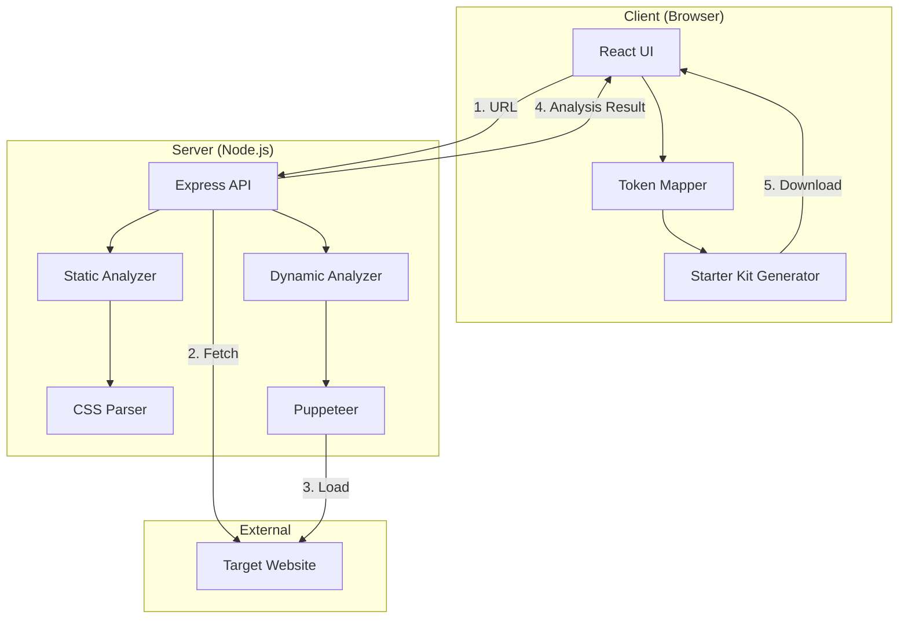
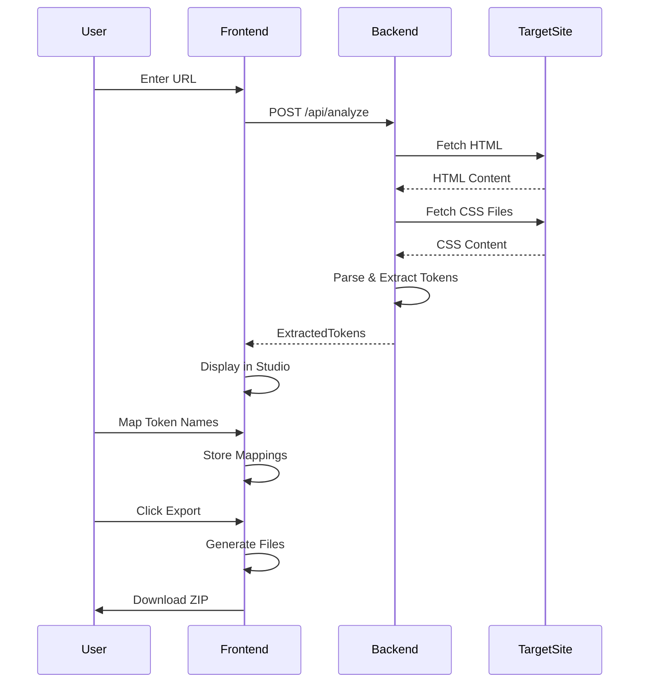

# Design Document: Project Snapshot

## Overview

Project Snapshot은 클라이언트-서버 아키텍처를 기반으로 한 웹 애플리케이션입니다. React 기반 프론트엔드는 사용자 인터페이스를 제공하고, Node.js/Express 백엔드는 웹사이트 분석 엔진을 실행합니다. 시스템은 정적 분석(CSS 파싱)과 동적 분석(헤드리스 브라우저 기반 모션 관찰)을 결합하여 포괄적인 디자인 시스템 추출을 수행합니다.

### Key Design Principles

1. **클라이언트 측 데이터 처리**: 개인정보 보호를 위해 사용자 데이터는 서버에 저장하지 않고 브라우저에서만 처리
2. **점진적 기능 제공**: MVP(정적 분석)부터 시작하여 동적 분석까지 단계적으로 구현
3. **확장 가능한 토큰 시스템**: 새로운 CSS 속성 추출을 쉽게 추가할 수 있는 플러그인 구조
4. **오류 복원력**: 부분적인 실패가 전체 분석을 중단시키지 않도록 설계

## Architecture

### System Architecture Diagram



### Technology Stack

**Frontend**
- React 18+ (UI 프레임워크)
- Axios (HTTP 클라이언트)
- JSZip (파일 압축)
- CSS Modules 또는 Styled Components (스타일링)

**Backend**
- Node.js 18+ (런타임)
- Express.js (웹 프레임워크)
- Axios (HTTP 클라이언트)
- Cheerio (HTML 파싱)
- Puppeteer (헤드리스 브라우저)
- CORS (크로스 오리진 요청 처리)

**Deployment**
- Frontend: Vercel 또는 Netlify
- Backend: Railway, Render, 또는 AWS EC2

## Components and Interfaces

### Frontend Components

#### 1. App Component
메인 애플리케이션 컨테이너

```typescript
interface AppState {
  analysisResult: AnalysisResult | null;
  isAnalyzing: boolean;
  error: string | null;
}
```

#### 2. URLInput Component
URL 입력 및 분석 시작

```typescript
interface URLInputProps {
  onAnalyze: (url: string) => Promise<void>;
  isDisabled: boolean;
}
```

#### 3. ProgressIndicator Component
분석 진행 상태 표시

```typescript
interface ProgressIndicatorProps {
  currentStep: string;
  details: string;
  isVisible: boolean;
}
```

#### 4. DesignStudio Component
토큰 매핑 인터페이스

```typescript
interface DesignStudioProps {
  tokens: ExtractedTokens;
  onTokenMap: (category: string, value: string, name: string) => void;
  tokenMappings: TokenMappings;
}

interface ExtractedTokens {
  colors: string[];
  fonts: FontToken[];
  spacing: string[];
  effects: EffectToken[];
  animations: AnimationToken[];
}

interface TokenMappings {
  [category: string]: {
    [value: string]: string; // value -> token name
  };
}
```

#### 5. TokenSection Component
특정 카테고리의 토큰 매핑 UI

```typescript
interface TokenSectionProps {
  title: string;
  tokens: any[];
  mappings: { [key: string]: string };
  onMap: (value: string, name: string) => void;
  renderToken: (token: any) => React.ReactNode;
}
```

#### 6. ExportOptions Component
내보내기 옵션 선택

```typescript
interface ExportOptionsProps {
  includeUnnamed: boolean;
  onToggleUnnamed: (include: boolean) => void;
  formats: ExportFormat[];
  onToggleFormat: (format: ExportFormat) => void;
}

type ExportFormat = 'css' | 'scss' | 'json' | 'tailwind';
```

#### 7. StarterKitGenerator Component
스타터 킷 생성 및 다운로드 (클라이언트 측에서 처리)

```typescript
interface StarterKitGeneratorProps {
  tokenMappings: TokenMappings;
  animations: AnimationToken[];
  motionReports: MotionReport[];
  exportOptions: ExportOptions;
  onGenerate: () => Promise<void>;
}

// StarterKitGenerator 내부 헬퍼 함수들
class StarterKitBuilder {
  static buildCSS(mappings: TokenMappings): string;
  static buildSCSS(mappings: TokenMappings): string;
  static buildJSON(mappings: TokenMappings): string;
  static buildTailwindConfig(mappings: TokenMappings): string;
  static buildAnimationCSS(animations: AnimationToken[]): Map<string, string>;
  static buildMotionReports(reports: MotionReport[]): Map<string, string>;
  static buildReadme(metadata: any): string;
}
```

### Backend Components

#### 1. Analysis Controller
분석 요청 처리

```typescript
interface AnalysisRequest {
  url: string;
  options?: {
    includeDynamic?: boolean;
    timeout?: number;
  };
}

interface AnalysisResponse {
  success: boolean;
  data?: AnalysisResult;
  error?: string;
}

interface AnalysisResult {
  tokens: ExtractedTokens;
  animations: AnimationToken[];
  motionReports?: MotionReport[];
  metadata: {
    analyzedUrl: string;
    timestamp: string;
    duration: number;
  };
}
```

#### 2. Static Analyzer
정적 CSS 분석

```typescript
class StaticAnalyzer {
  async analyze(url: string): Promise<ExtractedTokens>;
  private async fetchHTML(url: string): Promise<string>;
  private extractCSSLinks(html: string): string[];
  private async fetchCSS(urls: string[]): Promise<string>;
  private parseTokens(css: string): ExtractedTokens;
}

interface FontToken {
  family: string;
  size: string;
  weight: string;
  lineHeight: string;
}

interface EffectToken {
  type: 'shadow' | 'filter';
  value: string;
}

interface AnimationToken {
  name: string;
  keyframes: string;
  duration?: string;
  timingFunction?: string;
}
```

#### 3. CSS Parser
CSS 값 추출

```typescript
class CSSParser {
  extractColors(css: string): string[];
  extractFonts(css: string): FontToken[];
  extractSpacing(css: string): string[];
  extractEffects(css: string): EffectToken[];
  extractKeyframes(css: string): AnimationToken[];
  
  private deduplicateValues<T>(values: T[]): T[];
  private normalizeValue(value: string): string;
}
```

#### 4. Dynamic Analyzer
동적 모션 분석

```typescript
class DynamicAnalyzer {
  async analyze(url: string): Promise<MotionReport[]>;
  private async launchBrowser(): Promise<Browser>;
  private async observeAnimations(page: Page): Promise<ObservedAnimation[]>;
  private generateReport(animations: ObservedAnimation[]): MotionReport[];
}

interface ObservedAnimation {
  element: string; // CSS selector
  trigger: 'scroll' | 'hover' | 'load';
  properties: PropertyChange[];
  duration: number;
  easing: string;
}

interface PropertyChange {
  property: string;
  from: string;
  to: string;
}

interface MotionReport {
  id: string;
  description: string;
  trigger: string;
  duration: number;
  properties: PropertyChange[];
  codeSnippets: {
    css: string;
    js: string;
    gsap?: string;
  };
}
```


## Data Models

### Token Data Flow



### Database Schema

이 애플리케이션은 데이터베이스를 사용하지 않습니다. 모든 데이터는 다음과 같이 처리됩니다:

- **서버**: 요청 처리 중에만 메모리에 데이터 보관, 응답 후 삭제
- **클라이언트**: React state와 localStorage를 사용하여 세션 데이터 관리

### File Structure

생성되는 스타터 킷의 구조:

```
project-snapshot-kit/
├── design_system/
│   ├── tokens.css
│   ├── tokens.scss
│   ├── tokens.json
│   └── tailwind.config.js (optional)
├── motion_library/
│   ├── css/
│   │   ├── animation-1.css
│   │   └── animation-2.css
│   └── js_motion_reports/
│       ├── scroll-fade-in.md
│       └── hover-effect.md
└── README.md
```

## Error Handling

### Error Categories

1. **Network Errors**
   - URL 접근 불가
   - CSS 파일 다운로드 실패
   - 타임아웃

2. **Parsing Errors**
   - 잘못된 CSS 구문
   - 예상치 못한 HTML 구조

3. **Browser Errors**
   - Puppeteer 실행 실패
   - 페이지 로드 실패

4. **Client Errors**
   - 잘못된 URL 형식
   - 파일 생성 실패

### Error Handling Strategy

```typescript
class ErrorHandler {
  static handle(error: Error, context: string): ErrorResponse {
    if (error instanceof NetworkError) {
      return {
        type: 'network',
        message: '대상 웹사이트에 접근할 수 없습니다.',
        details: error.message,
        recoverable: true
      };
    }
    
    if (error instanceof ParsingError) {
      return {
        type: 'parsing',
        message: 'CSS 파일을 분석하는 중 오류가 발생했습니다.',
        details: error.message,
        recoverable: true
      };
    }
    
    // ... other error types
    
    return {
      type: 'unknown',
      message: '예상치 못한 오류가 발생했습니다.',
      details: error.message,
      recoverable: false
    };
  }
}

interface ErrorResponse {
  type: string;
  message: string;
  details: string;
  recoverable: boolean;
}
```

### Graceful Degradation

- CSS 파일 일부 다운로드 실패 → 성공한 파일만으로 분석 진행
- 동적 분석 실패 → 정적 분석 결과만 반환
- 특정 토큰 추출 실패 → 다른 토큰은 정상 제공

## Testing Strategy

### Unit Tests

**Frontend**
- Token mapping logic
- File generation functions
- URL validation
- State management

**Backend**
- CSS parsing functions
- Token extraction regex
- File builder functions
- Error handling

### Integration Tests

- API endpoint 테스트
- Frontend-Backend 통신
- 전체 분석 플로우

### E2E Tests

- 사용자 시나리오 기반 테스트
  1. URL 입력 → 분석 → 토큰 매핑 → 내보내기
  2. 오류 처리 시나리오
  3. 다양한 웹사이트 유형 테스트

### Test Data

- 테스트용 샘플 HTML/CSS 파일
- 다양한 CSS 패턴 (색상, 폰트, 애니메이션)
- 엣지 케이스 (빈 CSS, 잘못된 구문)

## Performance Considerations

### Optimization Strategies

1. **CSS 파싱 최적화**
   - 정규식 캐싱
   - 중복 제거 알고리즘 최적화
   - 대용량 CSS 파일 스트리밍 처리

2. **헤드리스 브라우저 최적화**
   - 브라우저 인스턴스 재사용
   - 불필요한 리소스 로딩 차단
   - 타임아웃 설정

3. **프론트엔드 최적화**
   - 대량 토큰 렌더링 시 가상화 (react-window)
   - 디바운싱을 통한 입력 최적화
   - 코드 스플리팅

### Performance Targets

- 정적 분석: 평균 5-10초
- 동적 분석: 평균 15-30초
- 파일 생성 및 다운로드: 1초 이내
- UI 반응성: 100ms 이내

## Security Considerations

### Input Validation

```typescript
class URLValidator {
  static validate(url: string): ValidationResult {
    // Protocol check
    if (!url.startsWith('http://') && !url.startsWith('https://')) {
      return { valid: false, error: 'HTTP(S) 프로토콜만 지원됩니다.' };
    }
    
    // Localhost/private IP blocking
    if (this.isPrivateIP(url)) {
      return { valid: false, error: '로컬 또는 사설 IP는 분석할 수 없습니다.' };
    }
    
    // URL format check
    try {
      new URL(url);
      return { valid: true };
    } catch {
      return { valid: false, error: '올바른 URL 형식이 아닙니다.' };
    }
  }
  
  private static isPrivateIP(url: string): boolean {
    // Implementation
  }
}
```

### Rate Limiting

```typescript
// Express middleware
const rateLimit = require('express-rate-limit');

const analysisLimiter = rateLimit({
  windowMs: 15 * 60 * 1000, // 15 minutes
  max: 10, // 10 requests per window
  message: '너무 많은 요청이 발생했습니다. 잠시 후 다시 시도해주세요.'
});

app.use('/api/analyze', analysisLimiter);
```

### CORS Configuration

```typescript
const corsOptions = {
  origin: process.env.FRONTEND_URL || 'http://localhost:3000',
  methods: ['GET', 'POST'],
  allowedHeaders: ['Content-Type'],
  maxAge: 86400 // 24 hours
};

app.use(cors(corsOptions));
```

### Content Security

- 사용자 입력 sanitization
- XSS 방지
- HTTPS 강제
- 민감한 정보 로깅 금지

## Deployment Architecture

### Frontend Deployment (Vercel)

```yaml
# vercel.json
{
  "buildCommand": "npm run build",
  "outputDirectory": "build",
  "env": {
    "REACT_APP_API_URL": "@api-url"
  }
}
```

### Backend Deployment (Railway/Render)

```yaml
# railway.toml / render.yaml
[build]
builder = "NIXPACKS"

[deploy]
startCommand = "npm start"
healthcheckPath = "/health"
healthcheckTimeout = 10

[[env]]
key = "NODE_ENV"
value = "production"
```

### Environment Variables

**Frontend**
- `REACT_APP_API_URL`: 백엔드 API URL

**Backend**
- `PORT`: 서버 포트
- `NODE_ENV`: 환경 (development/production)
- `FRONTEND_URL`: CORS를 위한 프론트엔드 URL
- `TIMEOUT`: 분석 타임아웃 (기본 30초)

## API Specification

### POST /api/analyze

분석 요청

**Request**
```json
{
  "url": "https://example.com",
  "options": {
    "includeDynamic": false,
    "timeout": 30000
  }
}
```

**Response (Success)**
```json
{
  "success": true,
  "data": {
    "tokens": {
      "colors": ["#FF0000", "#00FF00"],
      "fonts": [
        {
          "family": "Arial",
          "size": "16px",
          "weight": "400",
          "lineHeight": "1.5"
        }
      ],
      "spacing": ["8px", "16px", "24px"],
      "effects": [
        {
          "type": "shadow",
          "value": "0 2px 4px rgba(0,0,0,0.1)"
        }
      ],
      "animations": [
        {
          "name": "fadeIn",
          "keyframes": "@keyframes fadeIn { ... }",
          "duration": "300ms"
        }
      ]
    },
    "metadata": {
      "analyzedUrl": "https://example.com",
      "timestamp": "2025-11-13T10:00:00Z",
      "duration": 5234
    }
  }
}
```

**Response (Error)**
```json
{
  "success": false,
  "error": {
    "type": "network",
    "message": "대상 웹사이트에 접근할 수 없습니다.",
    "details": "ECONNREFUSED"
  }
}
```

### GET /health

헬스체크

**Response**
```json
{
  "status": "ok",
  "timestamp": "2025-11-13T10:00:00Z"
}
```

## Development Strategy: API-First Approach

### Implementation Order

이 프로젝트는 **API 계약(API Contract)**을 중심으로 개발을 진행합니다. 이를 통해 프론트엔드와 백엔드를 병렬로 개발할 수 있습니다.

### Phase 1: API Contract & Mock Server

1. **API 명세 확정**
   - `/api/analyze` 엔드포인트의 Request/Response 형식 확정
   - 위의 "API Specification" 섹션이 계약서 역할

2. **Mock API 서버 구축**
   ```typescript
   // Mock response for development
   app.post('/api/analyze', (req, res) => {
     res.json({
       success: true,
       data: {
         tokens: {
           colors: ['#FF0000', '#00FF00', '#0000FF'],
           fonts: [
             { family: 'Arial', size: '16px', weight: '400', lineHeight: '1.5' }
           ],
           spacing: ['8px', '16px', '24px'],
           effects: [
             { type: 'shadow', value: '0 2px 4px rgba(0,0,0,0.1)' }
           ],
           animations: [
             { name: 'fadeIn', keyframes: '@keyframes fadeIn { ... }' }
           ]
         },
         metadata: {
           analyzedUrl: req.body.url,
           timestamp: new Date().toISOString(),
           duration: 1000
         }
       }
     });
   });
   ```

3. **병렬 개발**
   - **프론트엔드 팀**: Mock API를 사용하여 전체 UI 완성
   - **백엔드 팀**: Mock 로직을 실제 분석 로직으로 점진적 교체

### Phase 2: Backend Implementation

Mock 서버의 각 부분을 실제 구현으로 교체:

1. HTML/CSS 다운로드 로직
2. CSS 파싱 및 색상 추출
3. 폰트 추출
4. 간격 및 효과 추출
5. 애니메이션 추출
6. 동적 분석 (Puppeteer)

각 단계마다 API 응답 형식은 동일하게 유지하므로 프론트엔드 수정 불필요.

### Phase 3: Integration & Testing

- Mock API를 실제 API로 교체
- 통합 테스트
- 성능 최적화

## Future Enhancements

### Phase 5: Advanced Features

1. **분석 히스토리**
   - localStorage를 사용한 최근 분석 기록
   - 즐겨찾기 기능

2. **토큰 비교**
   - 여러 사이트의 디자인 시스템 비교
   - 차이점 시각화

3. **AI 기반 토큰 네이밍**
   - 색상 값에서 의미 있는 이름 자동 제안
   - 컨텍스트 기반 네이밍

4. **협업 기능**
   - 분석 결과 공유 링크
   - 팀 토큰 라이브러리

5. **플러그인 시스템**
   - 커스텀 토큰 추출기
   - 커스텀 출력 형식
